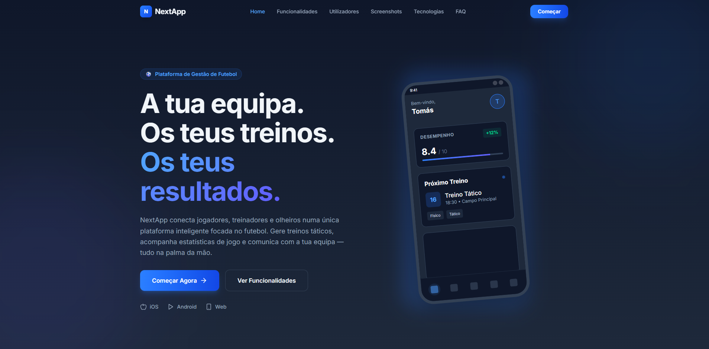

# NextApp - Plataforma de Gestão de Futebol



Website de apresentação moderno e responsivo para a NextApp, uma plataforma completa de gestão de futebol destinada a jogadores, treinadores e olheiros.

## 🚀 Visão Geral

O NextApp é uma solução digital inovadora que revoluciona a gestão do futebol em todos os níveis. Desde o jogador amador ao profissional, do treinador de base ao olheiro experiente, a nossa plataforma oferece ferramentas especializadas para cada perfil.

### 🎯 Público-Alvo

- **Jogadores**: Gestão de carreira, estatísticas pessoais e comunicação
- **Treinadores**: Planeamento de treinos, análise tática e gestão de plantel  
- **Olheiros (Scouts)**: Descoberta de talentos e relatórios profissionais

## ✨ Funcionalidades Principais

### Para Jogadores ⚽
- Estatísticas detalhadas de performance
- Agenda integrada de treinos e jogos
- Planos de treino personalizados
- Comunicação direta com treinadores
- Histórico de lesões e recuperação
- Highlights em vídeo

### Para Treinadores 📋
- Gestão completa de plantel
- Planeamento avançado de treinos
- Análise tática e estatística detalhada
- Convocatórias digitais automatizadas
- Calendário da época
- Comunicação eficiente com equipa

### Para Olheiros 🔍
- Base de dados global de jogadores
- Relatórios de observação padronizados
- Shadow Team para planamento
- Gestão inteligente de observações
- Talent ID com algoritmos avançados
- Modo espião para análise adversária

## 🛠️ Stack Tecnológica

| Tecnologia | Versão | Utilização |
|------------|--------|------------|
| **React** | 18.3.1 | Biblioteca principal de UI |
| **TypeScript** | 5.9.3 | Tipagem estática e segurança |
| **Vite** | 6.3.5 | Build tool ultra-rápido |
| **TailwindCSS** | 4.1.18 | Framework de estilos utility-first |
| **React Router** | Latest | Navegação SPA |
| **Framer Motion** | Latest | Animações fluidas e interativas |
| **Lucide React** | 0.487.0 | Biblioteca de ícones |
| **Vercel Analytics** | 1.6.1 | Monitorização de performance |

## 🏗️ Estrutura do Projeto

```
src/
├── components/          # Componentes reutilizáveis
│   ├── Hero.tsx       # Secção heróica principal
│   ├── Features.tsx   # Grid de funcionalidades
│   ├── UserTypes.tsx   # Tipos de utilizador
│   └── ...            # Outros componentes
├── pages/              # Páginas da aplicação
│   ├── Home.tsx       # Página principal
│   ├── PlayerPage.tsx # Página para jogadores
│   ├── CoachPage.tsx  # Página para treinadores
│   ├── ScoutPage.tsx  # Página para olheiros
│   └── ...            # Outras páginas
├── styles/             # Ficheiros de estilo
└── types/              # Definições TypeScript
```

## 🎨 Design & UX

- **Design System**: Cores consistentes por tipo de utilizador
  - Jogadores: Azul (`#3B82F6`)
  - Treinadores: Verde (`#10B981`) 
  - Olheiros: Púrpura (`#8B5CF6`)
- **Tema**: Dark mode optimizado para utilização profissional
- **Animações**: Micro-interações com Framer Motion
- **Responsividade**: Mobile-first design adaptável a todos os dispositivos

## 🚀 Performance & Otimizações

- **Build Optimized**: Bundle size otimizado com Vite
- **Lazy Loading**: Carregamento sob demanda de páginas
- **Image Optimization**: WebP/AVIF ready
- **SEO Completo**: Meta tags, Open Graph, JSON-LD
- **Core Web Vitals**: Optimizado para UX metrics

## 🔧 Configuração & Deploy

### Pré-requisitos
- Node.js 18+
- npm ou yarn

### Instalação
```bash
# Clonar o repositório
git clone <repository-url>
cd NextWeb

# Instalar dependências
npm install

# Iniciar development
npm run dev
```

### Scripts Disponíveis
```bash
npm run dev      # Servidor de desenvolvimento (localhost:3000)
npm run build    # Build para produção
npm run test     # Executar testes
```

### Deploy
O projeto está configurado para deploy na **Vercel** com:
- **Framework Preset**: Vite
- **Output Directory**: `dist`
- **SPA Routing**: Configurado via `vercel.json`

## 🧪 Testes

Configuração de testes com **Vitest** e **Testing Library**:
```bash
npm run test
```

## 📱 Browser Support

- Chrome/Chromium 90+
- Firefox 88+
- Safari 14+
- Edge 90+

## 🔗 Links Úteis

- **Live Demo**: [nextapp.pt](https://nextapp.pt)
- **Documentação**: [docs.nextapp.pt](https://docs.nextapp.pt)
- **API**: [api.nextapp.pt](https://api.nextapp.pt)

## 📈 Roadmap

- [ ] App nativa iOS/Android
- [ ] Integração com wearables
- [ ] AI-powered match analysis
- [ ] Blockchain para contratos
- [ ] Marketplace para transferências

## 🤝 Contribuição

Contribuições são bem-vindas! Por favor:

1. Fork o repositório
2. Crie uma feature branch (`git checkout -b feature/AmazingFeature`)
3. Commit as mudanças (`git commit -m 'Add some AmazingFeature'`)
4. Push para o branch (`git push origin feature/AmazingFeature`)
5. Abra um Pull Request

## 📄 Licença

Este projeto está licenciado sob a **MIT License** - veja o ficheiro [LICENSE](LICENSE) para detalhes.

## 📞 Contacto

- **Email**: geral@nextapp.pt
- **Website**: [nextapp.pt](https://nextapp.pt)
- **LinkedIn**: [NextApp Futebol](https://linkedin.com/company/nextapp)

---

**© 2026 NextApp - Revolutionizing Football Management** ⚽